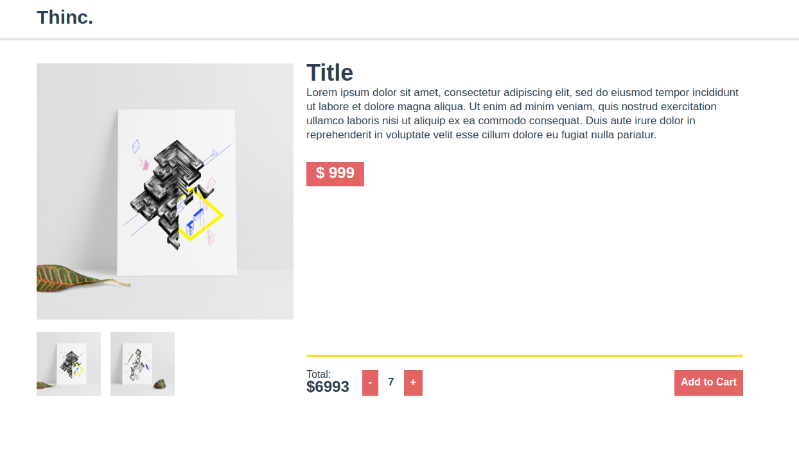

export { default as theme } from './theme';

# Thinc First Code
## Front End Web

---

# Contents
- What is Front End ?
- Our Activity Today
- HTML
- CSS
- JS (Vue)

---

# What is Front-end ?

Front-end is the part of an application that user interact directly.  
In our case, It's the webpage.

---

# Our activity today

We'll be making (fixing) this page using

`HTML`, `CSS` and `Vue`(Js)



---

# Setting up

Prerequisites:
- Source code : (https://github.com/hamzaabamboo/thinc-open-house)
- vscode : (https://code.visualstudio.com)
- nodejs : (https://nodejs.org)

---

# Setting up (cont'd)

Install dependencies 

```bash
$ npm install
# or if you have yarn
$ yarn
```

Start the server !

```bash
$ npm run serve
# or if you have yarn
$ yarn serve
```

---

# Part 1 : HTML

---

# What is HTML ?

**H**yper **T**ext **M**arkup **L**anguage  
Used to label parts of the page
---
# HTML: Basic syntax

3 Parts: tag, attributes and content

```html
<tag attribute="value">Content</tag>
```

---

| Tag name | Meaning          | Display type |
| -------- | ---------------- | ------------ |
| h1 - h6  | Heading 1 - 6    | inline       |
| p        | Paragraph        | block        |
| a        | <a>Anchor (link)</a>    | inline       |
| strong   | <strong>Bold</strong> | inline       |
| i        | <i>Italic</i>           | inline       |
| small    | <small>small text</small> | inline       |
| span     | inline-container | inline       |
| div      | block-container  | block        |
| ul       | unordered list   | block        |
| ol       | ordered list     | block        |
| li       | list item        | block        |
| button   | button           | inline       |
| input    | input field      | iniine       |
| img      | image tag        | inline       |

---

# Activity

Rearrange html tags and make it looks right  
`/src/components/HelloWorld.Vue`
```html
<template>
    <!-- stuff -->
    <div class="col prod-detail">
        <!-- lots of stuff -->
    </div>
    <!-- more stuff -->  
</template>
```

Optional: Change content of this page and make it your own item !

---

# Part 2 : CSS

---

# What is CSS ?

**C**ascading **S**tyle **S**heet

Styles for your html content

Try Deleting the whole `<style></style>` part of HelloWorld.vue

---

# CSS: Basic syntax

Consists of a selector and styling rules

```css
<selector> {
    rule: some value;
}
```

---

# CSS Selectors 

| Syntax     | Type          | Definition                                                     | Example                                  |
| ---------- | ------------- | -------------------------------------------------------------- | ---------------------------------------- |
| tagname    | tag selector  | select a html tag                                              | p -> `<p>Content</p>`                    |
| .classname | class elector | select an element which have attribute class name as specified | .header, -> `<div class="header"></div>` |
| #id        | ID selector   | select an element which have attribute id as specified         | #img-1 -> `` |
| * | Everything | selects everything | - |

---

# id vs class ?

Class can be applied to many elements  
ID can only be apply to one element

---

# Some CSS rules

- font: font-size, font-weight, font-family, color, text-decoration
- box: margin, padding, height, width, background
- layout: display, position, top, left, right, bottom, z-index
- animation: transition, transform, scale

---

# Activity

Customize your webpage !  
Change fonts, colors, text-size, layout 
/src/components/HelloWorld.vue
```jsx
<styles scoped>
    <!-- Lots of css ! -->
</styles>
```
Feel free to ask questions !

---

# Part 3 : JavaScript (vue)

---

# What is JavaScript ?

JavaScript adds the interactivity or "Logic" that HTML and CSS lacks  

---

# What is Vue ?
 
Vue is a popular JavaScript framework for making webpages

---

# Example: Quantity button

Try click plus or minus button !

/src/components/HelloWorld.vue
```html
<div class="button-group col">
    <button @click="quantity -= 1">-</button>
    <div class="text-display">{{ quantity }}</div>
    <button @click="quantity += 1">+</button>
</div>
```

---

# How it works ?

The button 

```html
<button @click="quantity += 1">+</button>
```
@click is a special attribute for Vue that lets you put in a function or short function inside.  
The function will run when the button is clicked
In this case, it adds quantity by one.

---

# Where is the quantity (variable) stored ?

Inside `<script>` tag of HelloWorld.vue
```js 
  data() {
    return {
      quantity: 0,
      // blah blah
    };
  },
```

---

# How is the number displayed inside HTML content ?

use double curly braces {{ }} to insert variable inside HTML

```html
<div class="text-display">{{ quantity }}</div>
```

---

# What if you want to do complex function ?

Most of the functions are stored in methods

```js
methods: {
    doSomethingDifficult() {
        // Do lots of stuff
        this.title = 'somethingCool';
    }
}
```

use **this** to refer to the variable you stored in **data()**

---

# Activity

1. Fill in missing price and total amount.
2. Make the Add-to-cart button _change value of **showModal**_ to show the confirm dialog
3. Make image gallery work
4. Open **Modal.vue** in the same folder and try to understand vue's props

Most of the instructions are already in the file.  
Good Luck !  
If you happend to get stuck, ask seniors around you !

---

# Ending Notes

Feel free to post the finished page to Social network with hashtags

## #ThincFirstCode #FrontEndยิ่งใหญ่!!

---

# Good Luck (with the midterm exam) and stay tuned

---